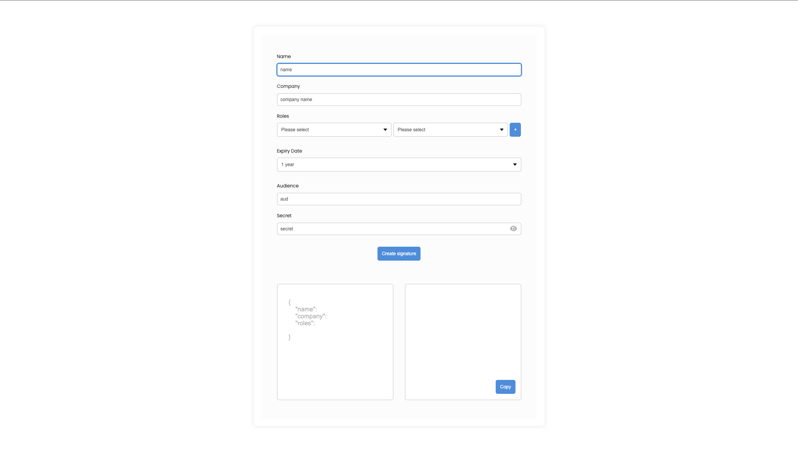

<h3 align="center">JWT generator</h3>

  

    An open-source JSON Web Token(JWT) Generator created by Enabler.no.
     
    <a href="https://jwt.enabler.no/" target="_blank" >View Demo</a>
    ·
    <a href="https://github.com/Enabler-AS/JWT-generator/issues">Report Bug</a>
  

<!-- ABOUT THE PROJECT -->

## About The Project

 
 

 
JWT generator allows you to generate JWT in an easy way! We created a form with inputs, so you can easly pass in the data and create a signature using HS256 algorithm.
 

(<a href="#top">back to top</a>)

### Built With

 
Project was built with React.js and TypeScript

- [React.js](https://reactjs.org/)
- [TypeScript](https://www.typescriptlang.org)

(<a href="#top">back to top</a>)

<!-- CONTACT -->

## Contact

Enabler.no - [www.enabler.no](www.enabler.no)
 

Email - [post@enabler.no](post@enabler.no)
 

LinkedIn - [https://www.linkedin.com/company/enabler-as/](https://www.linkedin.com/company/enabler-as/)
 

Instagram - [https://www.instagram.com/enabler.no/](https://www.instagram.com/enabler.no/)
 

Facebook - [https://www.facebook.com/EnablerAS](https://www.facebook.com/EnablerAS)
 

(<a href="#top">back to top</a>)

