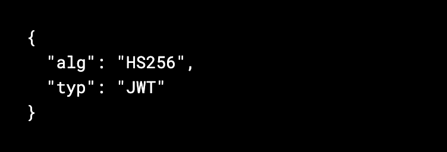
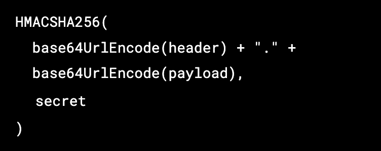
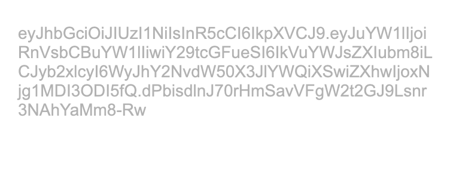

  

  <h1 align="center"><b>JWT generator</b></h1>
  

    An open-source JSON Web Token (JWT) generator created by <a href="www.enabler.no" target="_blank"><strong>enabler</strong></a>
   
  <a href="https://jwt.enabler.no/" target="_blank" >View Demo</a>
  ·    
  <a href="https://github.com/Enabler-AS/JWT-generator/issues">Report Bug</a>
  

   
  

    JWT generator allows you to generate JWT in an easy way!
     
    We created a form with inputs, so you can easly pass in the data and create a signature using HS256 algorithm.
  

  
  

    
     
     
    
    
    
    
  

 

# What is JSON Web Token?

JSON Web Token is a token-based standard that allows us to securely transfer information between two parties as a JSON object. The tokens are signed using cryptographic algorithm, either using a private secret (HMAC algorithm) or a public/private key (RSA).

JWT consists of three parts seperated by dots ( . ), which are:

- <a href="#header">Header</a>
- <a href="#payload">Payload</a>
- <a href="#signature">Signature</a>

So a JWT typically looks like:

> xxxxx.yyyyy.zzzzz

### Header

  The header usually consists of two parts:
  
  - algorithm used for signing, ex. HS256
  - type of the token, which is JWT.

   
  
      
    
  

   
  

    Then, this JSON is Base64Url encoded to form the first part of the JWT.
  

 

### Payload

  

    The payload contains the claims, which are statements about an entity (usually user) and additional data.
  

   
  

    
  

   
  

    The payload is then Base64Url encoded to form the second part of the JWT.
  

 

### Signature

  

    The signature is created by signing the encoded header that is providing the algorithm, encoded payload with all the data and the secret (symmetric or asymetetric dependent on which algorithm is used).
  

   
  

    
  

   
  

    The signature is used to ensure that the message was’t changed in the way. The party that creates the JWT signs the header and payload with a secret that is known to both the issuer and receiver, or with a private key known only to the sender. When the token is used, the receiving party verifies that the header and payload match the signature.
  

 

  

 

  The output is three Base64 strings separated by dots that can be easily passed in HTML and HTTP environments, while being more compact compared to XML-based standards such as SAML.

 

## When should we use JWT?

- Authentication
- Information Exchange

 

# Built With

Project was built with React.js and TypeScript

- [React.js](https://reactjs.org/)
- [TypeScript](https://www.typescriptlang.org)

 

# Contact

  

    
  

  <a href="www.enabler.no" target="_blank" >
    <strong>Enabler AS</strong>
  </a> is a newly started tech company based in Fredrikstad(Norway).
   
  

    <a href="www.enabler.no" target="_blank" ><strong>Enabler</strong></a> is established to create the workspace we have always wanted. It lies in creating unique and good products together with our skilled colleagues with a common set of values. Just as we are concerned with equal values, we are concerned with different perspectives, experiences and backgrounds. We believe that everyone has something to contribute.
     
    Our name has been chosen because we want to "enable" the potential that lies in the optimal use of technology.
  

 

### Contact us via:

- Enabler.no - [www.enabler.no](www.enabler.no)
- Email - [post@enabler.no](post@enabler.no)
- LinkedIn - [https://www.linkedin.com/company/enabler-as/](https://www.linkedin.com/company/enabler-as/)
- Instagram - [https://www.instagram.com/enabler.no/](https://www.instagram.com/enabler.no/)
- Facebook - [https://www.facebook.com/EnablerAS](https://www.facebook.com/EnablerAS)

 

(<a href="#top">back to top</a>)

